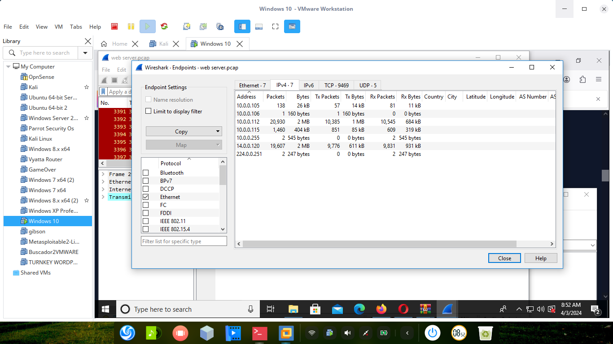

Table of Contents
What is the purpose of firewall 3
Is social media secure 5
How do you report risks 7
What is an incident and how do you manage it 8 
Open-source software and licensed software are available What should be 
preferred and why 9 
What are the different levels of data classification and why are 
they required? 11 
Various response codes from a web application 13
Object included in a good penetration testing report 16
How do you keep yourself updated with the information security news? 17
What have you done to protect your organization as a security professional 19
HIDS vs NIDS which one is better and why? 21
Tomcat Takeover Blue Team Challenge walkthrough 22
Safe Opener (PicoCTF 2022) 33
Private Investigator 36
Emprisa Maldoc Blue Team Lab 41
Phishing Email Challenge-LetsDefend Lab Walkthrough 52
LetsDefend — Suspicious Browser Extension
 59
